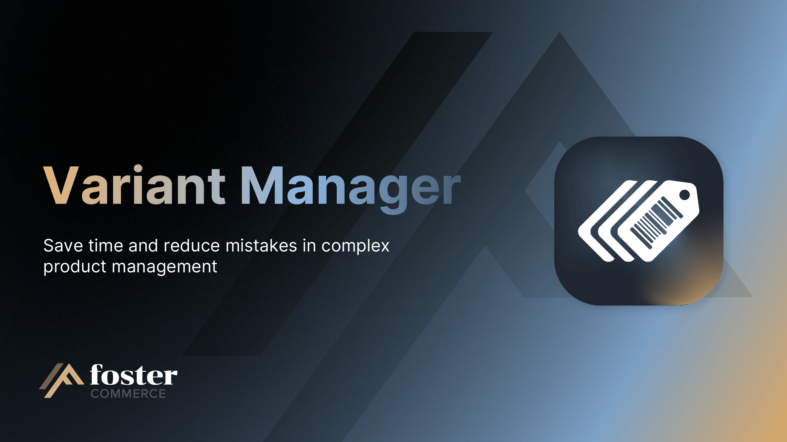

# Variant Manager

A Craft CMS plugin that imports and exports Craft Commerce product **variants** from CSV files.

## What it does

- Imports a CSV to create or update a Craft Commerce product and its variants.
- Bulk-imports many products at once from a zip of CSVs, each file becoming its own product.
- Exports a product to CSV from the product edit page, or many products at once from the Variants element index.
- Adds a **Variant Attributes** field that stores option name and value pairs (Color, Size, Material) on each variant for filtering on the storefront.
- Logs each import and export, with configurable retention, in a dashboard activity feed.

## Requirements

- Craft CMS `^5.0`
- Craft Commerce `^5.0`
- PHP `^8.2`

## Install

```sh
composer require fostercommerce/variant-manager
./craft plugin/install variant-manager
```

See [`docs/installation.md`](./docs/installation.md) for the full installation and configuration guide.

## Importing

Upload a CSV (or a zip of CSVs) from **Variant Manager -> Dashboard**. The CSV's filename determines the product: a new filename creates a new product, an existing product title updates that product. Each row becomes one variant. Columns map to product fields, variant fields, per-site Commerce fields, inventory levels, and variant attributes.

See [`docs/user-guide/importing.md`](./docs/user-guide/importing.md) and [`docs/user-guide/csv-format.md`](./docs/user-guide/csv-format.md).

## Exporting

Two ways to export: from a single product's edit page (sidebar **Export Product** button), or from the **Variants** element index using the **Export Variant Data** action on a multi-select. A single product downloads as one CSV; multiple products download as a zip. Exported CSVs are shaped so they can be reimported without edits to the column headers.

See [`docs/user-guide/exporting.md`](./docs/user-guide/exporting.md).

## Variant Attributes field

The plugin ships a **Variant Attributes** field type that you add to each product type's variant field layout. The field stores the option-name and option-value pairs from your CSV (Color: Red, Size: Small) as JSON on the variant, and exposes them to Twig for variant selectors and faceted filtering.

See [`docs/reference/field-type.md`](./docs/reference/field-type.md) for storage and Twig usage.

## Permissions

In addition to `accessPlugin-variant-manager`:

- `variant-manager:import`, upload CSVs and create or update products and variants.
- `variant-manager:export`, export products from the product edit page or the variants index.
- `variant-manager:manage`, clear the activity log and manage plugin data.

See [`docs/reference/permissions.md`](./docs/reference/permissions.md).

## License

Proprietary.
