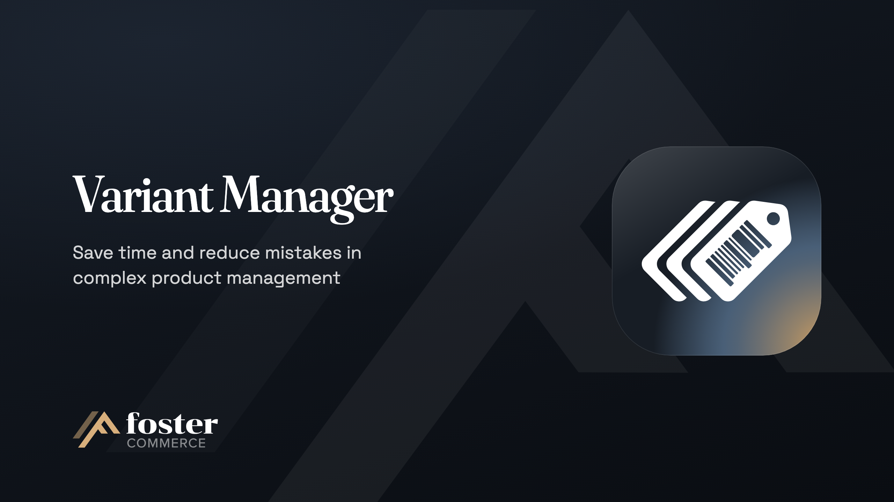

# Variant Manager

A Craft CMS plugin for managing Craft Commerce variants as combinations of **attributes and options**.

## Overview

- Add one Variant Attributes field to your variants instead of a hard-coded custom field per attribute (Color, Size, Material), and give each attribute and option its own custom fields for swatch images, hex values, and spec sheets.
- Add a new attribute or option by importing it, with no change to a field, a field layout, or a template.
- Build attribute pickers in Twig from each attribute's display type.
- Import a CSV to create or update a product and its variants, or a zip of CSVs to import many at once.
- Generate a product's variants from the attributes and options you choose, each combination with its own SKU and price.
- Export one product to CSV from its edit page, or many at once from the Commerce products index.
- Filter every variant in the store from one index, and bulk edit a field across a selection.

## Use Variant Manager when

- Your product types have a custom field per attribute (Color, Size, Material), or would need one.
- The same attributes appear on more than one product type and have to stay consistent.
- Adding an option has to work without a field, field layout, or template change.
- Product data comes from spreadsheets, an ERP, or a PIM, and every route has to write the same field.
- A product's variants are every combination of its options.
- The storefront renders swatches or dropdowns from variant data.

## Requirements

- Craft CMS `^5.0`
- Craft Commerce `^5.0`
- PHP `>=8.2.0`

## Install

```sh
composer require fostercommerce/variant-manager
./craft plugin/install variant-manager
```

For the full installation and configuration guide, see [installation](./docs/installation.md). If you are coming from 2.x or 3.x, see [upgrading](./docs/upgrade.md).

## Variant attributes

Commerce stores a variant as a unique SKU with no attribute structure, so adding an option to a hard-coded Color field means a developer edits the field's settings and a template.

Add the **Variant Attributes** field type to a product type's variant field layout instead. The field stores the name and value pairs on each variant, and a merchant adds new attributes and options without a developer. Every name and value also becomes its own element, so an attribute or an option can have a swatch image, a hex value, a spec sheet, or any custom field you add. Each attribute has a display type (dropdown, radio buttons, text buttons, image swatches, color swatches, lightswitch) that your Twig reads to render the picker.

For managing attributes and options, see [variant attributes](./docs/user-guide/variant-attributes.md). For what the field stores and the filter shapes it supports, see [the Variant Attributes field reference](./docs/reference/field-type.md) and [querying variants](./docs/dev-guide/twig-queries.md).

## Importing

Create or update a product and all of its variants from a spreadsheet.

Upload a CSV (or a zip of CSVs) from **Variant Manager -> Dashboard**. A zip runs each file as its own queue job, so one bad file does not stop the rest. A filename starting with a product ID (`42__classic-tee.csv`, the shape every export uses) updates that product; any other filename creates a new one. Columns map to product fields, variant fields, per-site Commerce fields, inventory levels, and variant attributes. Every run writes to an activity log with its outcome and, on failure, the reason.

See [importing](./docs/user-guide/importing.md), [CSV format](./docs/user-guide/csv-format.md), [bulk import](./docs/user-guide/bulk-import.md), [the activity log](./docs/user-guide/activity-log.md), and [troubleshooting](./docs/user-guide/troubleshooting.md).

## Variant Maker

Create a product's variants in the control panel, one for every combination of the attributes and options you pick.

Set the title, price, stock, and purchasing switches each variant starts with. An option's SKU partial and price modifier assemble the combination's SKU and price. The preview lists every combination and what generating would change, before any variant is written. The attributes and options have to be registered first.

Disabled by default for every product type.

See [the Variant Maker](./docs/user-guide/variant-maker.md).

## Exporting

Get a product's variants out as a CSV you can edit and reimport.

Export one product from the **Export Product** button in its edit page sidebar, or many at once with the **Export Variant Data** action on a selection at **Commerce -> Products**. A single product downloads as one CSV; multiple products download as a zip. The column headers need no editing before the file is reimported.

See [exporting](./docs/user-guide/exporting.md).

## Variants index

**Variant Manager -> Variants** lists every variant in the store on its own, rather than nested under its product, so a filter applies across the whole catalog. Filters cover stock, whether inventory is tracked, and each registered attribute, on top of Commerce's own product and SKU rules.

Select variants and the actions menu offers **Bulk edit field**, which writes one value to all of them.

See [the Variants index](./docs/user-guide/variants-index.md).

## Documentation

Visit the [Variant Manager plugin page](https://www.fostercommerce.com/craft-cms-plugins/variant-manager) for the full documentation, pricing, and changelog.

## License

Proprietary.

---

<a href="https://www.fostercommerce.com" target="_blank"></a>
