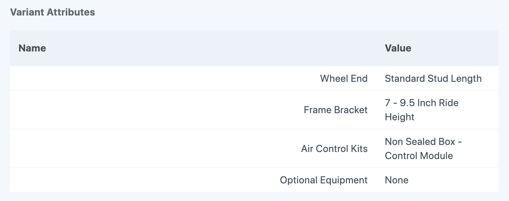
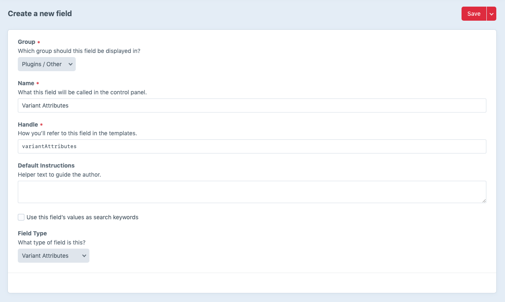
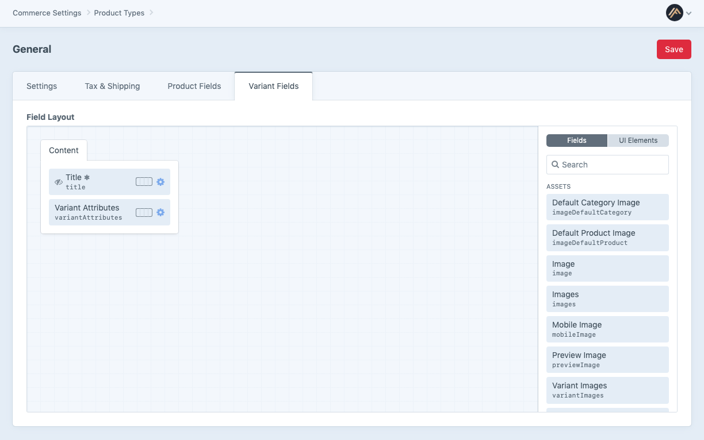

# The Variant Attributes Field

Variant Manager provides a "Variant Attributes" custom field type you need to add to your Craft Commerce variant field
layouts. This field is used by Variant Manager to save the variant attribute name and value pairs when imports occur,
and can be used in your Twig templates to allow users to [select a variant and add to cart](recipes/add-to-cart.md) or
[filter variants based on a selection](../recipes/variant-filter.md).

Content for this field can only be added via Variant Manager's import utility. Once added, a row's value field can be 
manually edited, however, the name cannot. This is intentional to reduce human error.

## Add the Variant Attributes field to your product types variants

In order for Variant Manager to import your variant data from your spreadsheets, and to use Twig tags in your templates
to filter and select variants, you will first need to add the "Variant Attributes" custom field included in Variant
Manager to your product type's variant field layouts.

### 1. Create a "Variant Attributes" field in Craft

Create a new custom field in Craft and select the "Variant Attributes" field type. The field type has no settings so you
just need to give it a unique name and field handle (ex. "Variant Attributes" and "variantAttributes" respectively).

### 2. Assign it to your product types variant fields

Now add the custom field you created to your product types variant field layouts for all of your product types that you
want to be able to import and export, and use twig tags for in your templates to filter and select variants.

