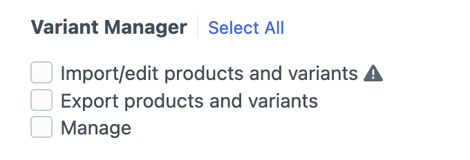

# Permissions

Variant Manager includes two permissions; One for importing products and variants and one for exporting.

These can be set on user groups in the Settings → Users section in Craft, or also on specific users in their Permissions
tab. The two permission settings are :

## Import products and variants

Allows users to import products through the Variant Manager dashboard.

#### `variant-manager:import`

## Export products and variants

Allows users to export products from Craft Commerce's product list or from individual products.

#### `variant-manager:export`

## Manage

Allows users to manage plugin data, such as clearing activity logs.

#### `variant-manager:manage`
