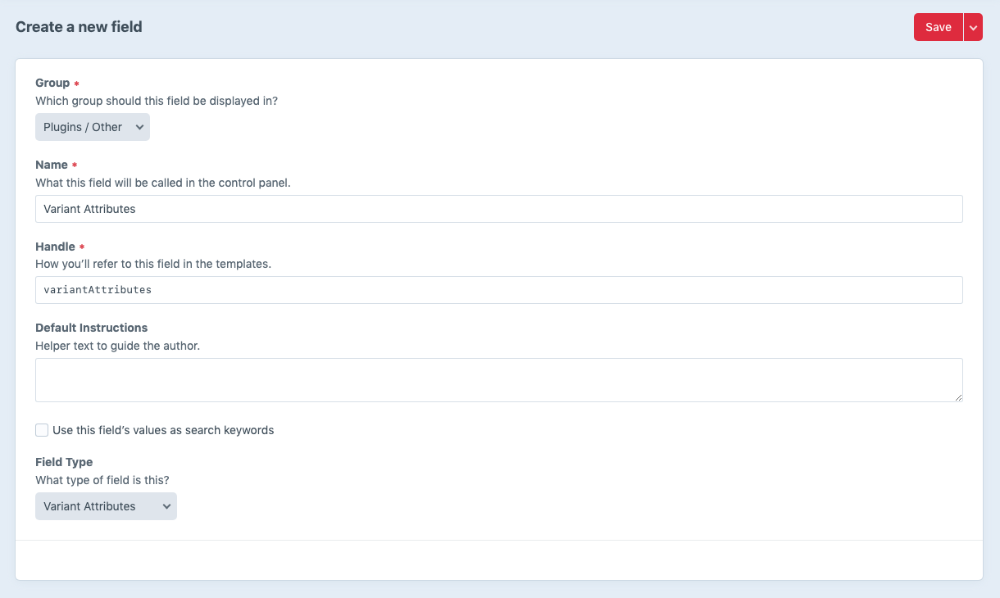
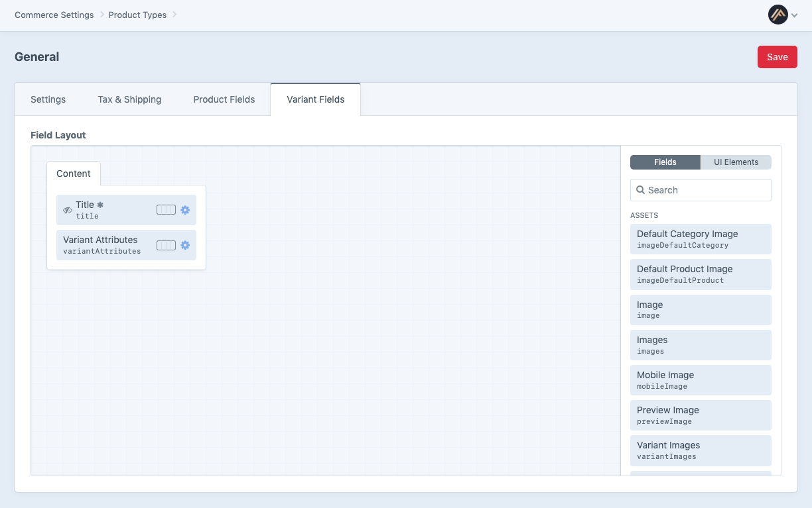
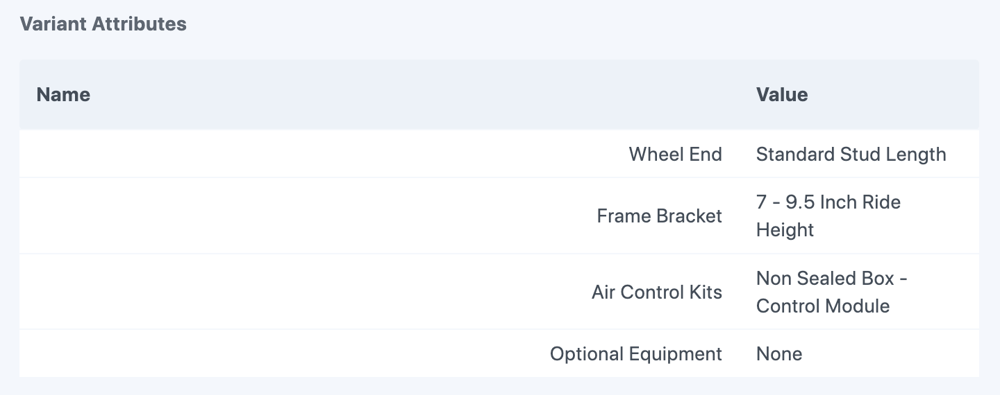

# Variant Attributes field

The custom field type that Variant Manager uses to store option name and value pairs on each variant. Audience: developers and admins setting up product types.

## Adding the field

1. **Settings -> Fields -> New field**.
2. Set **Field Type** to **Variant Attributes**. The field has no settings of its own.
3. **Commerce -> Settings -> Product Types -> {type} -> Variant Fields** and add the field to the variant field layout.




Only one Variant Attributes field per variant field layout is read by the plugin. Additional copies are ignored on import and export.

## What it stores

The field's value is an array of associative arrays, each one an attribute name and value:

```php
[
    ['attributeName' => 'Color', 'attributeValue' => 'Red'],
    ['attributeName' => 'Size', 'attributeValue' => 'Small'],
]
```

It is persisted as JSON in the element content row (`Schema::TYPE_JSON`). The field's `dbType` is JSON in both MySQL and PostgreSQL.

## Editing in the CP



The field's input UI on a variant edit page shows one row per attribute with the name and the value. The **attribute name** is read-only; only the **attribute value** can be edited from the CP. Names are deliberately locked to keep the import contract stable; renaming an attribute is done by reimporting the CSV with the new column header.

Variants whose attributes were not set by Variant Manager (for example variants created in the CP before the field existed) show the field empty. Fill it in by reimporting a CSV with the right `Attribute:` columns.

## Reading in Twig

The field's value is accessible by its handle:

```twig

  <li>{{ attribute.attributeName }}: {{ attribute.attributeValue }}</li>

```

Substitute the handle you gave the field for `variantAttributes`.

## Filtering in queries

Use the field handle as an element-query parameter on `craft.variants()` (Twig) or `Variant::find()` (PHP). The filter accepts a string, an associative array, or a list of either.

See [querying variants](../dev-guide/twig-queries.md) for the supported filter shapes and SQL behaviour.

## Listing all options for a product

The plugin exposes a Twig helper that returns the distinct attribute names and the set of values used across a product's variants:

```twig

```

See [template tags](../dev-guide/template-tags.md).
