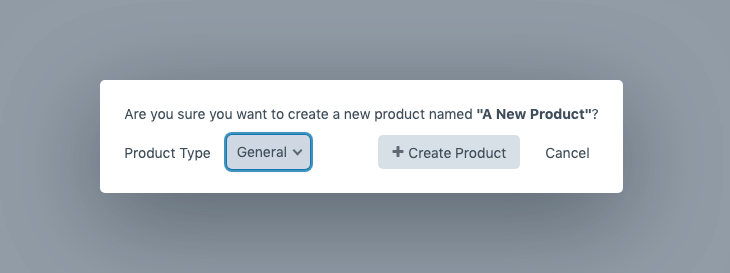
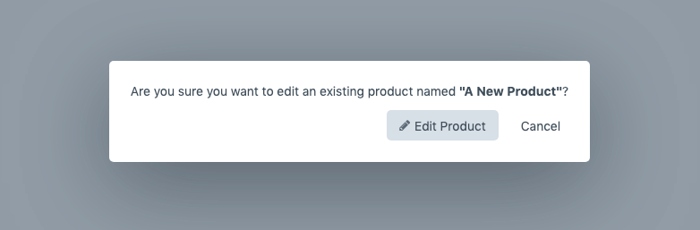
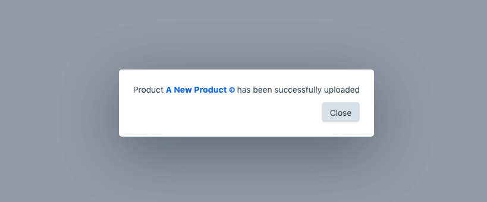

# Importing Product Variants into Craft Commerce

## Preparing your spreadsheet

To import your products from a spreadsheet, first you will need to ensure that your spreadsheet has the base variant
data in columns that Commerce needs and have been
[configured in the Variant Manager configuration file](../getting-started/configuration.md) (ex. "sku", "stock",
"price").

If you have product attributes that define a product variant (ex. color, size, etc.) they should also have columns in
your spreadsheet with the column name being the attribute name, and prefixed with what is configured as the
`optionPrefix` in the [Variant Manager configuration file](../getting-started/configuration.md)
(ex. "Option: Color" and "Option: Size").

If you have any plain text or number fields setup in your Commerce product type variants that you want to import from
your spreadsheet as well, these columns should also be present and use the name that is configured in the
[Variant Manager configuration file](../getting-started/configuration.md) (ex. "notes", "reference", etc)

You will then need to export your spreadsheet as a CSV file from your spreadsheet program and save it.

### For new products

If you are importing a new product that does not exist in Craft Commerce yet, name the exported CSV file with the name
of the product and Variant Manager will create the product for you before it imports the variant data into it.

### For existing products

If on the other hand you want to update an existing product's variants already in Craft Commerce, you will need to name
the exported CSV file with the exact name of the product as it appears in Craft Commerce.

## Importing your CSV

Once you have your CSV file ready, click the "Upload Product" button in the Variant Manager dashboard and select
your exported CSV file. The file will be uploaded to Craft and depending on if Variant Manager has detected if this is
a new product, or you are updating an existing product, you will be asked how you would like to proceed.

### New product import

For new products you can select the Commerce product type the product should belong to before clicking the "Create
Product" button to begin the import process.

### Existing product import

For existing products you will be asked to confirm you want to edit the existing product's variants before clicking the
"Edit Product" button to begin the import process.

### Product import confirmation

Upon success you will see a confirmation message with a link to the Craft Commerce Product that has just been added or
updated.

