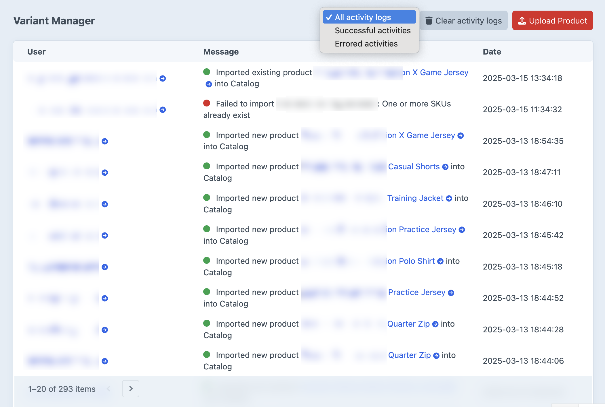
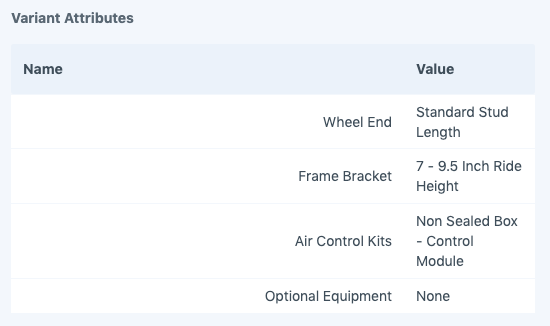

# Overview

The goal of Variant Manager is to make managing a complex product catalog easier in Craft Commerce. Although Craft
Commerce offers a system to manually input the data for products and their many variants, it can become quite cumbersome
when dealing with a catalog of products that have many variations based on multiple options.

A common method to manage product catalogs for businesses is to use a spreadsheet to keep track of things like
stock, SKU's, prices, and the various options that are included for each item. So rather than trying to
shoe-horn product managers into using Craft Commerce's manual method of data entry for product variants, Variant Manager
embraces the spreadsheet approach, allowing you to import and export your product variants directly from your
spreadsheet via a CSV file.

## Control Panel Dashboard

Once the plugin is [installed](../getting-started/setup.md) and [configured](../getting-started/configuration.md), in
your Craft Control Panel you will be able to access the Variant Manager dashboard.

The dashboard will display a history of the imports that have already been made, and an "Upload Product" button which
will allow you to upload a CSV file to import your products.

## The Variant Attributes Field

Variant Manager provides a "Variant Attributes" field type you add to your Craft Commerce variant field layouts.
This field is used by Variant Manager to save the variant attribute name and value pairs when imports occur, and can be
used on your templates to allow users to [filter variants based on a selection](../recipes/variant-filter.md) or
[select a variant based on the variants attribute values](../recipes/variant-switcher.md).

The field does not have any settings, so you simply need to add it to your Craft Commerce product's variant field layout.

## Next Steps
- [Importing Product Variants](usage/importing.md)
- [Exporting Product Variants](usage/exporting.md)
