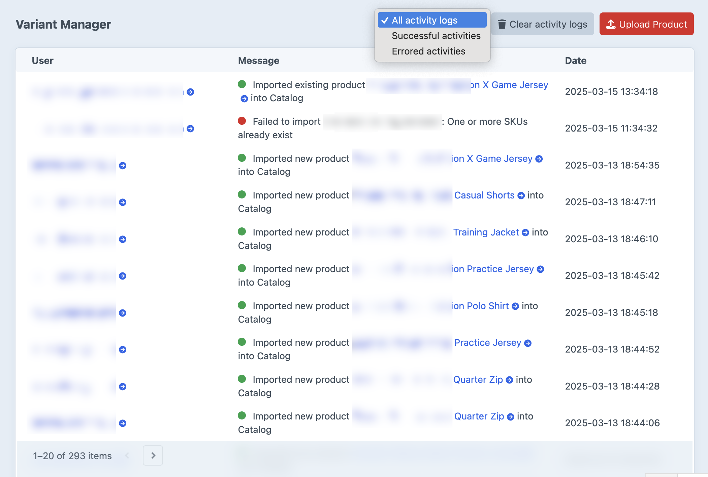

# Activity log

Where to find a record of past imports, and how to keep it from growing forever. Audience: anyone running imports.

## What gets logged

Every import attempt writes one row to the activity log, success or failure:

- **Successful imports** (green status dot): "Imported new product {title} into {product type}" or "Imported existing product {title} into {product type}". The product title is a link to the product edit page.
- **Failed imports** (red status dot): "Failed to import {filename}: {error message}". The error message is the same one the import threw, useful for diagnosing what went wrong.

Each row records the user who triggered the import and the date.

## Where to find it

**Variant Manager -> Dashboard**.



The dropdown next to the **Clear activity logs** button filters by status:

- **All activity logs**
- **Successful activities**
- **Errored activities**

Filter to **Errored activities** while debugging a failed batch.

## Retention

Rows are kept for as long as the `activityLogRetention` config setting says. Default: `30 days`.

Cleanup happens two ways:

- **Automatically**, during Craft's garbage collection (`./craft gc` or whenever Craft schedules it).
- **Manually**, by running the cleanup console command.

To keep logs forever, set `activityLogRetention` to `false` or `null` in `config/variant-manager.php`. The retention setting accepts any relative date string PHP understands: `1 hour`, `1 day`, `1 week`, `1 month`, `1 year`.

## Clearing the log

Two ways:

- **From the dashboard**: click **Clear activity logs** and confirm. Wipes every row regardless of age. Requires the `variant-manager:manage` permission.
- **Via console**:

  ```sh
  # Delete rows older than activityLogRetention (the default cleanup).
  ./craft variant-manager/activities/clear

  # Wipe every row regardless of age.
  ./craft variant-manager/activities/clear --all
  ```

Either way, cleared rows are gone permanently; there is no trash to restore from.

## Permissions

`variant-manager:manage` is required to clear logs from the dashboard. Anyone with `accessPlugin-variant-manager` can read the log.

See [permissions](./permissions.md).
