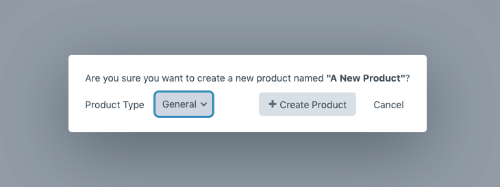
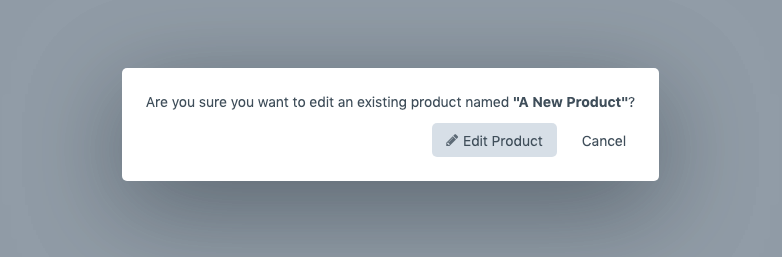
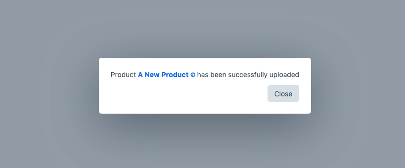

# Importing

How to upload a CSV to create or update a product in Craft Commerce. Audience: anyone preparing product data in a spreadsheet.

If you have not built the CSV yet, start with [CSV format](./csv-format.md).

## 1. Name the file correctly

The filename decides what happens when you upload it.

- **Creating a new product**: name the file with the product's exact title plus `.csv`. `Classic Tee.csv` creates a product titled `Classic Tee`.
- **Updating an existing product**: name the file with the existing product's exact title plus `.csv`. Capitalisation, spacing, and punctuation all have to match what is in Commerce.
- **Reimporting an export**: leave the filename Variant Manager generated. Exports are named `{id}__{slug}.csv` (for example `42__classic-tee.csv`); the number before `__` ties the upload back to the same product regardless of any title edits since export.

If you are unsure, export the product first and edit that file rather than building a filename by hand.

See [CSV format: the filename matters](./csv-format.md#the-filename-matters) for more.

## 2. Save as CSV from your spreadsheet

In Excel: **File -> Save As -> CSV UTF-8 (Comma delimited)**. In Numbers or Google Sheets: **File -> Export -> CSV**.

Avoid:

- Saving with `;` as the separator.
- Saving with smart quotes in column headers.
- Saving with a BOM (some apps add one to CSV UTF-8; pick plain "CSV (comma-delimited)" if your app lists both).

See [CSV format: common mistakes](./csv-format.md#common-mistakes) for the full list.

## 3. Open the dashboard

In the CP, go to **Variant Manager -> Dashboard**.

You will see:

- An **Upload Product** button (top right).
- A **Clear activity logs** button next to it.
- An activity log table of past imports below.

## 4. Click Upload Product and pick your file

The file picker opens. Select your CSV (or zip, see [bulk import](./bulk-import.md)). Variant Manager checks whether a product with that filename already exists and opens a modal asking you to confirm.

The modal shows one of three flows depending on what it found.

### New product

"Are you sure you want to create a new product?"

- **Product Type** dropdown: pick the Commerce product type the new product should belong to. Required.
- **Create Product** button: starts the import.
- **Cancel** button: abandons the upload.

Click **Create Product** to queue the import.

### Existing product

"Are you sure you want to edit an existing product named **\"{title}\"**?"

You are about to update an existing product. The modal does not show a Product Type dropdown (the existing product keeps its type), but it does show one new choice:

#### Existing product update options

A radio group titled **Refresh variants** with two options:

- **Update and remove extra variants** (default). The import updates variants whose SKUs match rows in the CSV, and deletes any existing variants whose SKUs are not in the CSV. Use this for a complete catalog sync where the CSV is the source of truth.
- **Replace all variants**. The plugin deletes every existing variant on the product before importing, then creates fresh variants from the CSV. Use this when you are starting over for that product.

There is no option to import only the changes. If you want to update only a few variants, export the product first to get a CSV with all variants, edit the rows you need, and reupload.

Click **Edit Product** to queue the import.

### Zip file

If you picked a zip file the modal asks the same questions as the new-product flow, plus the refresh-variants choice. See [bulk import](./bulk-import.md) for the full zip flow.

## 5. Wait for the queue

The upload responds with "File {your-file}.csv has been queued for processing" and the page refreshes. The import runs as a Craft queue job, not immediately.

Watch the dashboard's activity log for the result:

- A green status dot means the import succeeded. The message links to the new or updated product.
- A red status dot means the import failed. The message contains the failure reason.

If your queue is not running automatically, run `./craft queue/run` from the project directory.

## 6. Verify the result

For a successful import, click the linked product title in the activity log to jump to the product edit page. Check:

- The variants tab has the expected rows.
- Variant SKUs, prices, and attributes match what you expected.
- The product status (enabled or disabled) is what you set in the `status` column (default: enabled).

If anything is wrong, the safest fix is to edit the source CSV and re-upload it; the import is idempotent on existing products.

## When something goes wrong

Failed imports show their error in the activity log. The two most common reasons are a misnamed CSV and a SKU that already exists on a different product. See [troubleshooting](./troubleshooting.md).

**Failed queue jobs**: delete them. Retrying a failed import job will fail with the same error because the data in the job is the data that failed. Fix the CSV and re-upload it instead. See [cleaning up failed import jobs](./troubleshooting.md#cleaning-up-failed-import-jobs).

