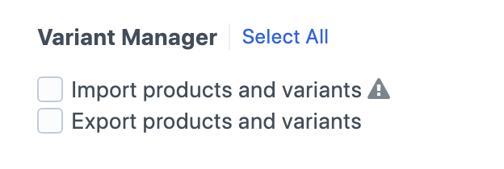

# Permissions

Which user groups and users can do what in Variant Manager. Set permissions at **Users -> {group} -> Permissions** or **Users -> {user} -> Permissions**.

## Permission summary

| Permission | What it allows |
|------------|---------------|
| `accessPlugin-variant-manager` | See the **Variant Manager** CP nav item and read the dashboard. Required for any of the others to be useful. |
| `variant-manager:import` | Upload CSVs and create or update products and variants from the dashboard. |
| `variant-manager:export` | Export products from the product edit page sidebar or the Variants element index action. |
| `variant-manager:manage` | Clear the activity log from the dashboard. |

## Choosing what to grant

- **Product team**: grant `accessPlugin-variant-manager`, `variant-manager:import`, and `variant-manager:export`. They get the full import-edit-export round trip without touching plugin internals.
- **Support or read-only roles**: grant `accessPlugin-variant-manager` alone. They can see imports happen but cannot upload or export.
- **Admins or operations leads**: grant all three permissions, including `variant-manager:manage`, so they can clear logs.

Site admins bypass every permission check; they always have full access.

## Warnings

`variant-manager:import` carries a warning at the permission edit screen ("Imports can potentially overwrite existing variants"). The default existing-product import deletes any variant whose SKU is not in the CSV, so grant import access only to people who understand that behaviour. See [importing](./importing.md#existing-product-update-options) for the refresh-variants choices and what they do.
