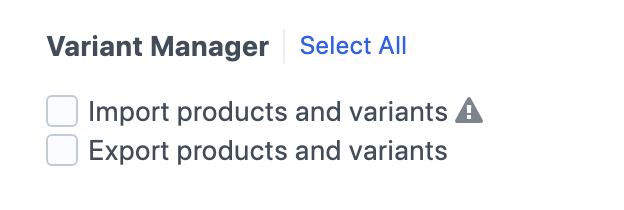

# Permissions

Which user groups and users can do what in Variant Manager. Set permissions at **Users -> {group} -> Permissions** or **Users -> {user} -> Permissions**.

For the full list, see [permissions reference](../reference/permissions.md).

## Choosing what to grant

- **Product team**: grant `accessPlugin-variant-manager`, `variant-manager:import`, and `variant-manager:export`. They get the full import-edit-export round trip.
- **Support or read-only roles**: grant `accessPlugin-variant-manager` alone. They can see imports happen but cannot upload or export.
- **Merchandisers**: add `variant-manager:manage-attributes` on top of the product team set, so they can edit attribute and option titles, display types, and custom fields without running imports. Field layouts stay admin-only.
- **Admins or operations leads**: grant everything, including `variant-manager:manage` for clearing logs and `variant-manager:manage-attributes` for editing attributes and running the utility.

Site admins bypass every permission check; they always have full access.

## Warnings

`variant-manager:import` shows a warning at the permission edit screen ("Imports can potentially overwrite existing variants"). The default existing-product import deletes any variant whose SKU is not in the CSV, so grant import access only to people who understand that behavior. For what each variant-handling choice does, see [importing](./importing.md#existing-product-update-options).
